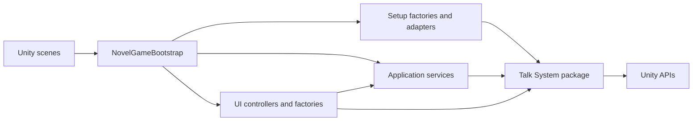

# WhiteRoom architecture

WhiteRoom is a Unity application layered over the embedded Talk System package.
The architecture optimizes for a small, explicit runtime graph, reusable
dialogue infrastructure, and Issue-sized changes.

The normative decisions are:

- [ADR-0001: Keep WhiteRoom product policy outside Talk System](../adr/0001-talk-system-boundary.md)
  ([日本語](../adr/0001-talk-system-boundary.ja.md))
- [ADR-0002: Use an explicit composition root and split runtime responsibilities](../adr/0002-runtime-responsibility-split.md)
  ([日本語](../adr/0002-runtime-responsibility-split.ja.md))
- [ADR-0003: Use Issue-driven delivery and bilingual ADR pairs](../adr/0003-issue-driven-bilingual-adrs.md)
  ([日本語](../adr/0003-issue-driven-bilingual-adrs.ja.md))

## Runtime map

Arrows mean "may depend on." Talk System never depends on WhiteRoom application
code.

## Ownership

| Area | Owns | Must not own |
| --- | --- | --- |
| `Assets/Scripts/NovelGameBootstrap.cs` | startup, scene events, composition | business rules, widget construction, storage details |
| `Assets/Scripts/Setup` | object creation, component wiring, compatibility seams | game progression and save policy |
| `Assets/Scripts/Services` | use cases, progress, save/load policy | visual layout |
| `Assets/Scripts/UI` | presentation controllers and fallback UI construction | file storage and dialogue-engine internals |
| `Packages/com.kkmia.talksystem` | reusable dialogue runtime, schemas, presentation primitives | WhiteRoom scenes, routes, or product policy |

## Change placement

- A rule unique to WhiteRoom belongs under `Assets/Scripts`.
- A capability useful to multiple games belongs in Talk System and requires
  package-level tests and documentation.
- Unity object construction belongs in `Setup`; orchestration belongs in a
  service or controller.
- Scene entry and exit belong in the bootstrap, which should delegate after
  translating the lifecycle event.
- A new cross-boundary dependency requires an ADR update or a superseding ADR.

## Quality gates

Every behavior change must have:

- a linked Issue with observable acceptance criteria;
- focused automated tests when the behavior can regress;
- Unity batch-mode compilation for Unity-facing changes;
- documentation updates for changed contracts or operator workflows;
- an ADR for decisions matching the ADR criteria.

The governance checker provides inexpensive structural enforcement. Unity tests
remain the source of truth for runtime behavior.

## Known architectural debt

- WhiteRoom application scripts currently compile in `Assembly-CSharp`; no
  application-specific assembly definition enforces directory boundaries.
- Application-specific automated tests have not yet been added.
- Runtime fallback UI uses code-driven construction, which needs targeted visual
  smoke testing as presentation complexity grows.
- Some setup code uses reflection to configure Talk System components.

These are constraints to resolve through separate Issues, not invitations to
expand unrelated changes.
