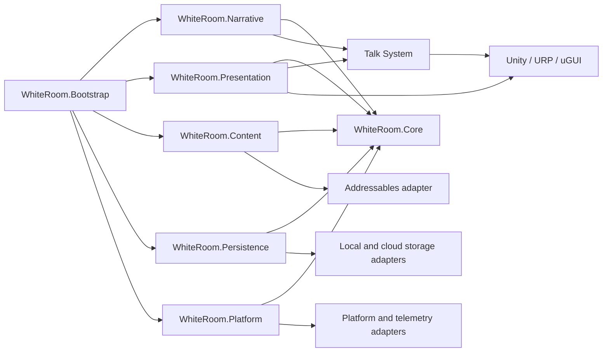
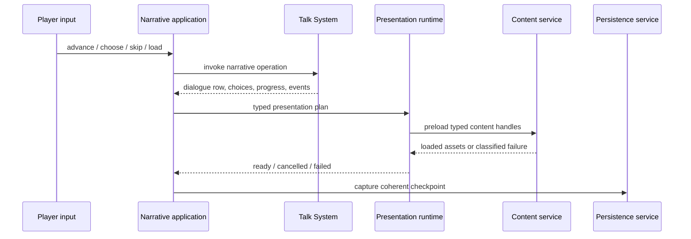

# WhiteRoom product architecture

WhiteRoom is a commercial Unity visual-novel client built as a modular monolith
over the embedded Talk System package. The target architecture is designed for
large narrative and media volume, parallel content production, long-lived save
compatibility, multiple release targets, and evidence-based quality gates.

This document is a map, not a second source of decisions. The English ADRs are
normative; their Japanese counterparts provide the human-facing translation.

The concrete classes of the current runtime slice are diagrammed in
[the runtime class diagram](class-diagram.md)
([日本語](class-diagram.ja.md)).

## Decision map

| Concern | Normative decision |
| --- | --- |
| Reusable dialogue vs. product policy | [ADR-0001](../adr/0001-talk-system-boundary.md) ([日本語](../adr/0001-talk-system-boundary.ja.md)) |
| Composition root and current responsibilities | [ADR-0002](../adr/0002-runtime-responsibility-split.md) ([日本語](../adr/0002-runtime-responsibility-split.ja.md)) |
| Issue-driven delivery and bilingual records | [ADR-0003](../adr/0003-issue-driven-bilingual-adrs.md) ([日本語](../adr/0003-issue-driven-bilingual-adrs.ja.md)) |
| Product modules and assembly boundaries | [ADR-0004](../adr/0004-modular-monolith-boundaries.md) ([日本語](../adr/0004-modular-monolith-boundaries.ja.md)) |
| Unity, renderer, and runtime UI baseline | [ADR-0005](../adr/0005-unity-urp-runtime-baseline.md) ([日本語](../adr/0005-unity-urp-runtime-baseline.ja.md)) |
| Asset identity, loading, packaging, and updates | [ADR-0006](../adr/0006-addressable-content-delivery.md) ([日本語](../adr/0006-addressable-content-delivery.ja.md)) |
| Narrative, UI, and asset localization authority | [ADR-0007](../adr/0007-localization-source-contract.md) ([日本語](../adr/0007-localization-source-contract.ja.md)) |
| Save envelope, migration, recovery, and cloud boundary | [ADR-0008](../adr/0008-versioned-save-compatibility.md) ([日本語](../adr/0008-versioned-save-compatibility.ja.md)) |
| Cues, async presentation, cancellation, and restore | [ADR-0009](../adr/0009-deterministic-presentation-runtime.md) ([日本語](../adr/0009-deterministic-presentation-runtime.ja.md)) |
| Test evidence, releases, platforms, and observability | [ADR-0010](../adr/0010-release-quality-platform-boundary.md) ([日本語](../adr/0010-release-quality-platform-boundary.ja.md)) |
| Reached scene/choice navigation and checkpoint restore | [ADR-0011](../adr/0011-reached-boundary-navigation.md) ([日本語](../adr/0011-reached-boundary-navigation.ja.md)) |

## Target dependency map

Arrows mean "may depend on." `WhiteRoom.Core` depends on none of the other
runtime modules, Unity, Talk System, or vendor SDKs. Concrete content,
persistence, and platform adapters do not depend on each other. Talk System
never depends on WhiteRoom.

## Runtime control flow

Talk System is authoritative for route and dialogue progression. Presentation
completion cannot mutate route truth directly. Save capture is permitted only
at a coherent narrative/presentation checkpoint.

## Module ownership

| Module | Owns | Must not own |
| --- | --- | --- |
| `WhiteRoom.Core` | stable IDs, product results, policy, ports, use-case contracts | Unity objects, Talk System types, files, vendor SDKs |
| `WhiteRoom.Narrative` | Talk System adaptation, route use cases, conditions, events, progress meaning | asset addresses, screen construction, cloud SDK calls |
| `WhiteRoom.Content` | content manifest, typed handles, Addressables adapter, lifetime and download policy | route rules, direct presentation effects |
| `WhiteRoom.Persistence` | save envelope, migrations, local/cloud storage adapters, conflict policy | scene serialization, narrative rendering |
| `WhiteRoom.Presentation` | uGUI screens, cue plans, stage/audio/camera presenters, cancellation and restore | route authority, storage implementation, bundle layout |
| `WhiteRoom.Platform` | capability ports and adapters for users, entitlements, achievements, telemetry, lifecycle | narrative branching, save payload ownership |
| `WhiteRoom.Bootstrap` | startup, scene lifecycle, installers, concrete object graph | business rules, widget implementation, vendor policy |
| Talk System package | reusable dialogue runtime, schema, validation, preview, progress primitives | WhiteRoom routes, release channels, platform or product policy |

Implementation classes default to internal. Cross-module contracts are typed,
minimal, and owned by the module that defines their meaning.

## Data and content authority

| Data | Authority | Runtime delivery |
| --- | --- | --- |
| Route topology, conditions, events, progress markers | Talk System scenario CSV | Content service to `IDialogueRepositoryLoader` |
| Localized narrative rows | Talk System translation CSV keyed by dialogue ID | Product localization service |
| Product UI strings and localized non-dialogue assets | Unity Localization String/Asset Tables | Localization and content services |
| Background, cast, expression, voice, music, movie, and set-piece mapping | Versioned WhiteRoom semantic catalogs | Content service and presentation runtime |
| Per-slot player progress | WhiteRoom save envelope containing Talk System state | Persistence service |
| Global settings and unlocks | WhiteRoom-owned versioned sections | Persistence service |
| Build/content compatibility | Immutable release and content manifests | Boot/recovery shell |

Published IDs are never recycled. Asset paths, Addressable addresses, scene
instance IDs, SDK types, and Unity object references are not durable product
identities.

## Release model

Player code and content are independently versioned but compatibility-checked:

1. A pinned Unity/package/platform toolchain produces an immutable player.
2. A content build produces an immutable catalog, manifest, and archived
   Addressables content-state artifact.
3. The manifest declares player compatibility, product channel, required packs,
   and locale availability.
4. Development, QA, certification, and production promote the same artifacts
   where the platform allows.
5. Rollback selects a previously validated artifact; production content is not
   overwritten in place.

Remote content, cloud saves, achievements, analytics, and crash reporting are
capabilities, not assumptions. The boot/recovery shell remains usable when a
remote capability is absent or failing.

## Quality gates

Every behavior or content change has a linked Issue and acceptance evidence at
the lowest reliable layer:

- pure C# policy and migration tests;
- module integration and Unity EditMode tests;
- Talk System dialogue, branch, key, and localization validation;
- Addressables/content identity and dependency validation;
- PlayMode flow, input, presentation cancellation, and restore tests;
- headless all-route and all-ending simulation;
- frozen shipped-save compatibility fixtures;
- representative locale, glyph, safe-area, controller, and visual checks;
- target-device performance, lifecycle, storage, smoke, and soak evidence;
- immutable build/content manifests and machine-readable reports.

Waivers are owned, Issue-linked, time-bounded, and recorded with the release.
Dialogue text, player-entered names, raw saves, tokens, and filesystem paths are
excluded from shipping telemetry.

## Current migration state

The checked-in game remains a vertical slice and is not yet compliant with the
full target architecture:

- application scripts still compile in `Assembly-CSharp`;
- scenario and fallback font loading still use `Resources`;
- Addressables, Unity Localization, URP production profiles, product module
  asmdefs, and application-specific automated tests are not yet established;
- runtime fallback UI is code-driven;
- some Talk System setup uses constrained reflection.

Migration must proceed as Issue-sized vertical slices. A slice adds its contract,
implementation, focused tests, content migration where needed, Unity validation,
and rollback plan together. Existing player-visible behavior and serialized
references must remain valid during the transition.
