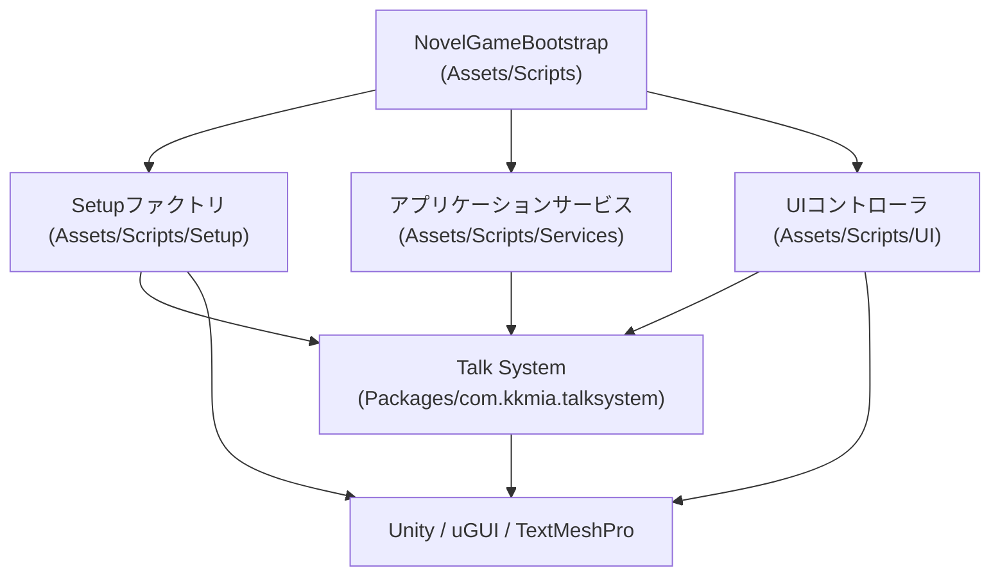
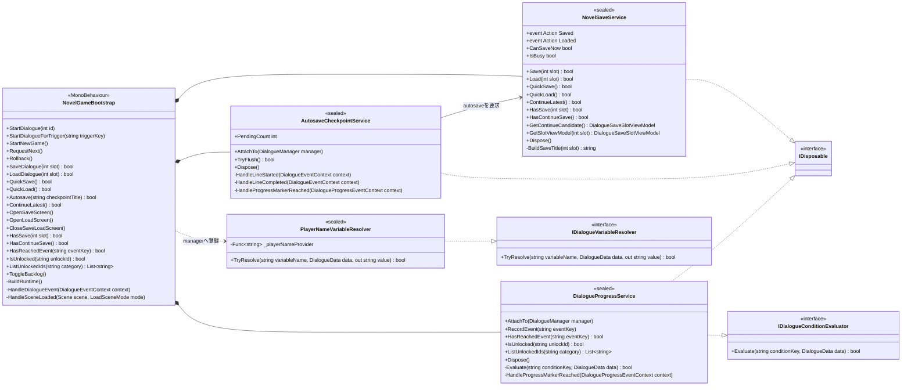
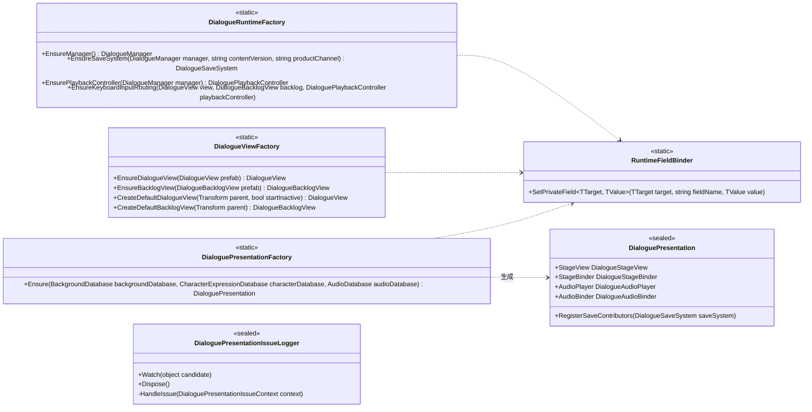
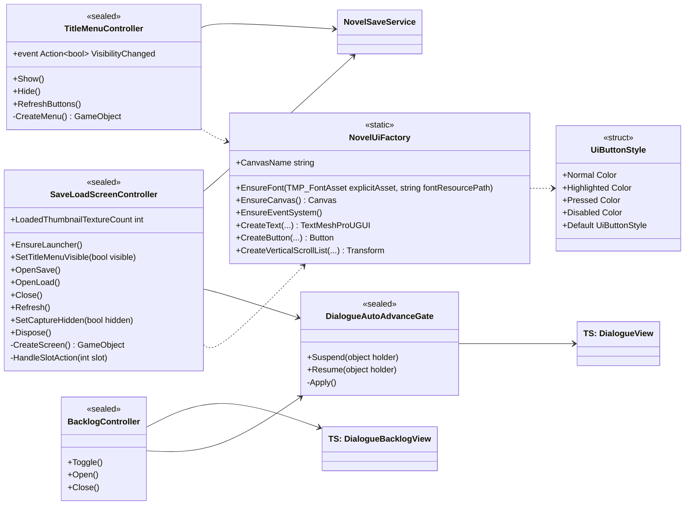

# WhiteRoom ランタイムクラス図

[English version](class-diagram.md)

この文書は、現在のランタイム縦切り実装の具体的なクラス、すなわち
`Assets/Scripts`(名前空間 `WhiteRoom.Novel`)の全クラスと、それらが協調する
Talk System 型を図示する。ターゲットのモジュールアーキテクチャを説明する
[アーキテクチャマップ](README.md)を補完するもので、本ファイルは「現時点で
チェックインされているもの」と「ターゲットへの対応付け」を記述する。

規範となるのは英語版ADRである。この図とコードが食い違う場合はコードが正で
あり、クラス構造を変更するPRと同じPRでこのファイルを更新すること。

## レイヤー概要

アプリケーションは
[ADR-0002](../adr/0002-runtime-responsibility-split.ja.md)の責務分割に従う:
単一のComposition Root、生成と配線を担う `Setup` のファクトリ群、ユースケース
を担う `Services`、プレゼンテーションを担う `UI`
([AGENTS.md](../../AGENTS.md) のアーキテクチャ制約)。

矢印は「依存してよい」方向を意味する。`Services` と `UI` は `Setup` を呼ばず、
リフレクションによる互換コード(`RuntimeFieldBinder`)は `Setup` の内側に
留める。Talk System は `WhiteRoom.Novel` に依存しない
([ADR-0001](../adr/0001-talk-system-boundary.ja.md))。

## クラス関係の全体図

可読性のためメンバー一覧はここでは省略し、後続のレイヤー別の図に示す。
`TS:` は再利用可能な Talk System 型を表す。

```mermaid
classDiagram
    direction TB

    class NovelGameBootstrap
    class DialogueRuntimeFactory
    class DialogueViewFactory
    class DialoguePresentationFactory
    class DialoguePresentation
    class DialoguePresentationIssueLogger
    class RuntimeFieldBinder
    class NovelSaveService
    class AutosaveCheckpointService
    class DialogueProgressService
    class PlayerNameVariableResolver
    class TitleMenuController
    class SaveLoadScreenController
    class BacklogController
    class DialogueAutoAdvanceGate
    class NovelUiFactory
    class UiButtonStyle

    class DialogueManager["TS: DialogueManager"]
    class DialogueSaveSystem["TS: DialogueSaveSystem"]
    class DialoguePlaybackController["TS: DialoguePlaybackController"]
    class DialogueView["TS: DialogueView"]
    class DialogueBacklogView["TS: DialogueBacklogView"]
    class DialogueStageView["TS: DialogueStageView"]
    class DialogueAudioPlayer["TS: DialogueAudioPlayer"]
    class IDialogueConditionEvaluator["TS: IDialogueConditionEvaluator"]
    class IDialogueVariableResolver["TS: IDialogueVariableResolver"]
    class IDialoguePresentationIssueSource["TS: IDialoguePresentationIssueSource"]

    NovelGameBootstrap ..> DialogueRuntimeFactory : ランタイム構築
    NovelGameBootstrap ..> DialogueViewFactory : ビュー構築
    NovelGameBootstrap ..> DialoguePresentationFactory : 舞台・音声構築
    NovelGameBootstrap ..> NovelUiFactory : フォント・Canvas確保
    NovelGameBootstrap *-- NovelSaveService : 所有
    NovelGameBootstrap *-- AutosaveCheckpointService : 所有
    NovelGameBootstrap *-- DialogueProgressService : 所有
    NovelGameBootstrap *-- DialoguePresentationIssueLogger : 所有
    NovelGameBootstrap *-- TitleMenuController : 所有
    NovelGameBootstrap *-- SaveLoadScreenController : 所有
    NovelGameBootstrap *-- BacklogController : 所有
    NovelGameBootstrap ..> PlayerNameVariableResolver : 登録
    NovelGameBootstrap --> DialogueManager : 駆動
    NovelGameBootstrap --> DialogueView : 保持

    DialogueRuntimeFactory ..> DialogueManager : 確保
    DialogueRuntimeFactory ..> DialogueSaveSystem : 確保
    DialogueRuntimeFactory ..> DialoguePlaybackController : 確保
    DialogueRuntimeFactory ..> RuntimeFieldBinder : 配線
    DialogueViewFactory ..> DialogueView : 確保
    DialogueViewFactory ..> DialogueBacklogView : 確保
    DialogueViewFactory ..> NovelUiFactory : フォールバックUI構築
    DialogueViewFactory ..> RuntimeFieldBinder : 配線
    DialoguePresentationFactory ..> DialoguePresentation : 生成
    DialoguePresentationFactory ..> NovelUiFactory : Canvas利用
    DialoguePresentationFactory ..> RuntimeFieldBinder : 配線
    DialoguePresentation --> DialogueStageView : 公開
    DialoguePresentation --> DialogueAudioPlayer : 公開
    DialoguePresentation ..> DialogueSaveSystem : contributor登録
    DialoguePresentationIssueLogger --> IDialoguePresentationIssueSource : 監視

    NovelSaveService --> DialogueManager : 現在行を参照
    NovelSaveService --> DialogueSaveSystem : 永続化を委譲
    AutosaveCheckpointService --> DialogueManager : checkpoint eventを購読
    AutosaveCheckpointService --> NovelSaveService : autosaveを要求
    AutosaveCheckpointService --> DialoguePlaybackController : Auto/Skipを一時停止
    DialogueProgressService ..|> IDialogueConditionEvaluator
    DialogueProgressService --> DialogueManager : ProgressMarkerReached購読
    PlayerNameVariableResolver ..|> IDialogueVariableResolver

    TitleMenuController --> NovelSaveService : 照会・ロード
    TitleMenuController ..> NovelUiFactory : メニュー構築
    SaveLoadScreenController --> NovelSaveService : スロット保存・読込
    SaveLoadScreenController --> DialogueAutoAdvanceGate : 一時停止
    SaveLoadScreenController ..> NovelUiFactory : 画面構築
    BacklogController --> DialogueBacklogView : 開閉
    BacklogController --> DialogueAutoAdvanceGate : 一時停止
    DialogueAutoAdvanceGate --> DialogueView : 自動送りを制御
    NovelUiFactory ..> UiButtonStyle : ボタン装飾
```

## Composition Root とサービス

サービスとコントローラを生成し相互に購読させるのは `NovelGameBootstrap`
だけである。ビジネスルールはサービス側にあり、Bootstrapには置かない。

サービス間の協調はイベントベースである。Bootstrapは
`NovelSaveService.Saved` / `Loaded` に反応して画面を更新・非表示にし、
`DialogueProgressService` は `DialogueManager.ProgressMarkerReached` 発火時に
Talk System の `DialogueUnlockRegistry` + `DialogueUnlockSaveService` の
ペアを通じてアンロックを永続化する。セーブスロットの方針(バージョン付き
エンベロープ、クイックセーブスロット、コンティニュー候補)は
[ADR-0008](../adr/0008-versioned-save-compatibility.ja.md)に従い
Talk System 側に留まる。
具体的なcheckpointとContinue規則は
[Autosave checkpointとContinue選択](../development/autosave-checkpoints.ja.md)に記載する。
Thumbnail sidecar captureとUI lifecycleは
[Save thumbnail](../development/save-thumbnails.ja.md)に記載する。

## Setup ファクトリ

`Setup` はオブジェクト生成と Talk System の配線を所有する。ファクトリは
状態を持たない static クラスであり、シーン上の既存インスタンスを見つけるか、
フォールバックを生成する。Talk System のシリアライズ済みフィールドへの
リフレクションはすべてこのレイヤー内の `RuntimeFieldBinder` 呼び出しに
限定される。

`DialogueViewFactory` の優先順位は、シーン上の既存インスタンス、
シリアライズされたプレハブ、コード生成のフォールバックUIの順である。
フォールバック経路は既知の移行ギャップであり
([アーキテクチャマップ](README.md#current-migration-state))、
新しい画面は新たなファクトリコードではなくプレハブから作ること。

## UI コントローラ

`UI` はプレゼンテーションコントローラとランタイムUI構築を所有する。
コントローラは Bootstrap から駆動されるプレーンな C# クラスであり、
サービスとは協調するが `Setup` には依存しない。

`DialogueAutoAdvanceGate` は参照カウント式のゲートである。オーバーレイ
(バックログ、セーブ/ロード画面)が開いている間は自動送りを停止し、
すべての保持者が解放したときにのみ再開する。

## ターゲットモジュールへの対応付け

[ADR-0004](../adr/0004-modular-monolith-boundaries.ja.md)がターゲットの
モジュラーモノリスを定義する。現在、アプリケーションスクリプトはすべて
`Assembly-CSharp` でコンパイルされている。この表は各クラスの移行先を記録し、
移行スライスが境界を再決定せずにクラスを移動できるようにする。

| 現在のクラス | ターゲットモジュール |
| --- | --- |
| `NovelGameBootstrap` | `WhiteRoom.Bootstrap` |
| `DialogueRuntimeFactory`, `DialogueViewFactory`, `DialoguePresentationFactory`, `RuntimeFieldBinder` | `WhiteRoom.Bootstrap`(インストーラ) |
| `DialoguePresentation`, `DialoguePresentationIssueLogger` | `WhiteRoom.Presentation` |
| `NovelSaveService` | `WhiteRoom.Persistence`(アプリケーション面) |
| `DialogueProgressService` | `WhiteRoom.Narrative` |
| `PlayerNameVariableResolver` | `WhiteRoom.Narrative` |
| `TitleMenuController`, `SaveLoadScreenController`, `BacklogController`, `DialogueAutoAdvanceGate` | `WhiteRoom.Presentation` |
| `NovelUiFactory`, `UiButtonStyle` | `WhiteRoom.Presentation`(プレハブ駆動UIへの置換まで) |

## この図が符号化する設計ルール

- **Composition Root は一つ。** コラボレータを生成・配線するのは
  `NovelGameBootstrap` のみで、他のクラスはファクトリを呼ばない
  ([ADR-0002](../adr/0002-runtime-responsibility-split.ja.md))。
- **依存は内向き。** `UI → Services → Talk System`。サービスとコントローラは
  `Setup` を参照せず、Talk System は `WhiteRoom.Novel` を参照しない
  ([ADR-0001](../adr/0001-talk-system-boundary.ja.md))。
- **境界では具象より契約。** プロダクト方針はTalk Systemのインターフェース
  (`IDialogueConditionEvaluator`、`IDialogueVariableResolver`、
  save contributor)を通じて接続し、パッケージの改変では行わない。
- **リフレクションは隔離する。** `RuntimeFieldBinder` とその呼び出し元は
  `Setup` にのみ存在し、各使用箇所は拡張すべきパターンではなく移行負債で
  ある。
- **機能横断の反応はイベントで。** `Saved` / `Loaded` /
  `VisibilityChanged` / `ProgressMarkerReached` により、サービスは自分に
  反応する画面を知らずに済む。

## メンテナンス

クラスの追加・削除・改名、またはレイヤーやターゲットモジュールの割り当てが
変わるときは、同じPRで本文書の両言語版を更新すること。図を記憶から拡張せず、
`Assets/Scripts` に対して関係を検証すること。
