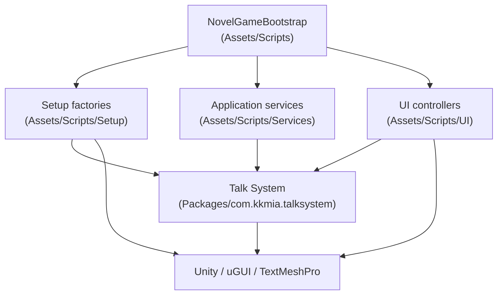
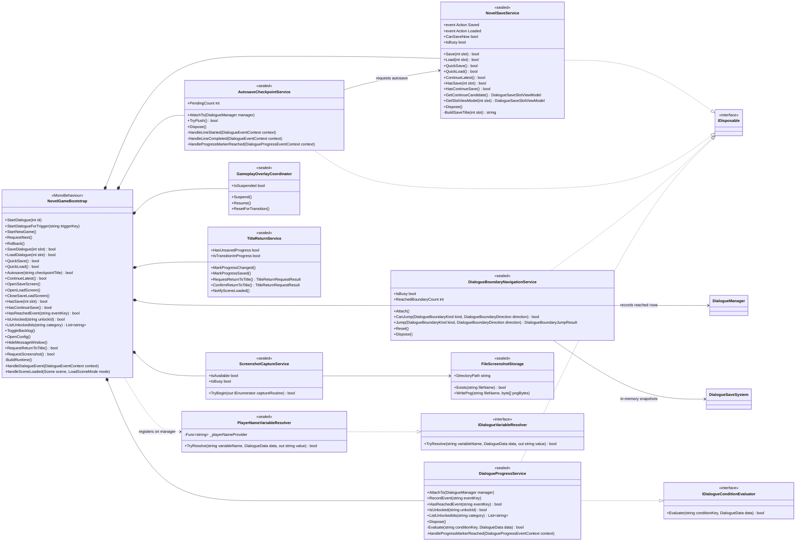
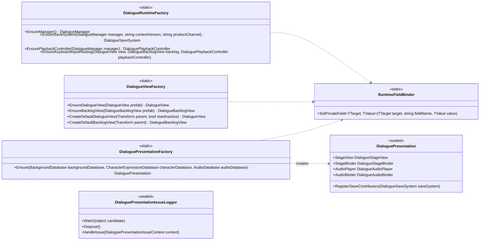
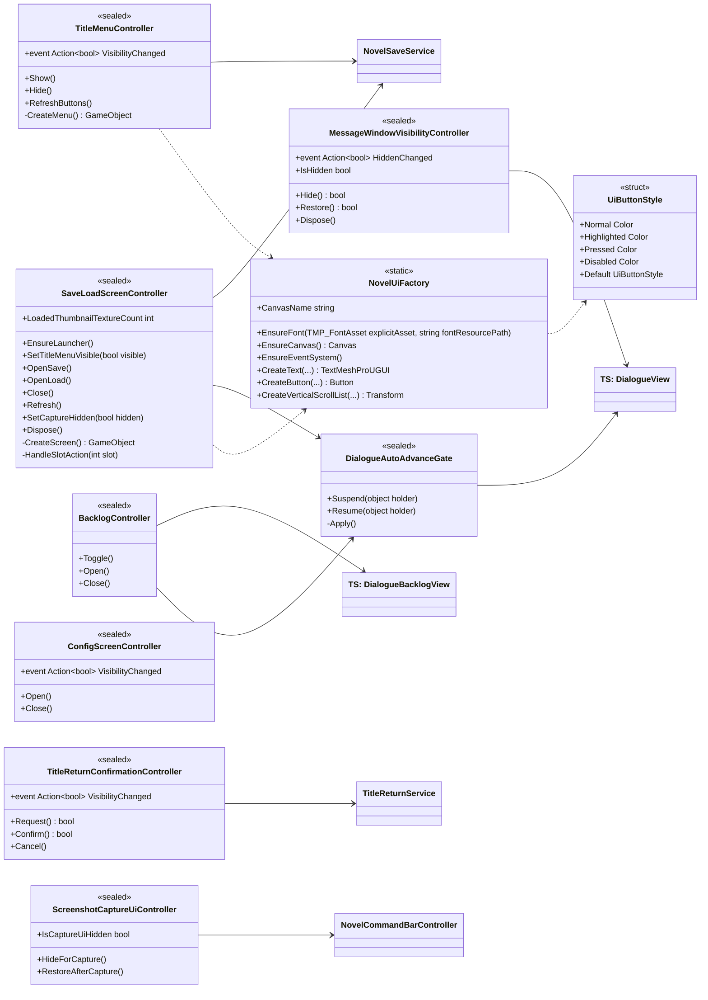

# WhiteRoom runtime class diagram

[日本語版](class-diagram.ja.md)

This document diagrams the concrete classes of the current runtime vertical
slice: everything in `Assets/Scripts` (namespace `WhiteRoom.Novel`) and the
Talk System types they collaborate with. It complements
[the architecture map](README.md), which describes the target module
architecture; this file describes what is checked in today and how it maps to
that target.

The English ADRs remain normative. If this diagram and the code disagree, the
code wins; update this file in the same PR that changes the class structure.

## Layer overview

The application follows the responsibility split in
[ADR-0002](../adr/0002-runtime-responsibility-split.md): one composition root,
creation-and-wiring factories in `Setup`, use-case services in `Services`, and
presentation controllers in `UI`
([AGENTS.md](../../AGENTS.md) architecture constraints).

Arrows mean "may depend on". `Services` and `UI` never call into `Setup`;
reflection-based compatibility code (`RuntimeFieldBinder`) stays inside
`Setup`. Talk System never depends on `WhiteRoom.Novel`
([ADR-0001](../adr/0001-talk-system-boundary.md)).

## Full class relationships

Member lists are omitted here for readability; the per-layer diagrams below
show them. `TS:` marks reusable Talk System types.

```mermaid
classDiagram
    direction TB

    class NovelGameBootstrap
    class DialogueRuntimeFactory
    class DialogueViewFactory
    class DialoguePresentationFactory
    class DialoguePresentation
    class DialoguePresentationIssueLogger
    class RuntimeFieldBinder
    class NovelSaveService
    class AutosaveCheckpointService
    class DialogueBoundaryNavigationService
    class DialogueProgressService
    class GameplayOverlayCoordinator
    class TitleReturnService
    class ScreenshotCaptureService
    class FileScreenshotStorage
    class PlayerNameVariableResolver
    class TitleMenuController
    class SaveLoadScreenController
    class BacklogController
    class ConfigScreenController
    class MessageWindowVisibilityController
    class TitleReturnConfirmationController
    class ScreenshotCaptureUiController
    class DialogueAutoAdvanceGate
    class NovelUiFactory
    class UiButtonStyle

    class DialogueManager["TS: DialogueManager"]
    class DialogueSaveSystem["TS: DialogueSaveSystem"]
    class DialoguePlaybackController["TS: DialoguePlaybackController"]
    class DialogueView["TS: DialogueView"]
    class DialogueBacklogView["TS: DialogueBacklogView"]
    class DialogueStageView["TS: DialogueStageView"]
    class DialogueAudioPlayer["TS: DialogueAudioPlayer"]
    class IDialogueConditionEvaluator["TS: IDialogueConditionEvaluator"]
    class IDialogueVariableResolver["TS: IDialogueVariableResolver"]
    class IDialoguePresentationIssueSource["TS: IDialoguePresentationIssueSource"]

    NovelGameBootstrap ..> DialogueRuntimeFactory : builds runtime via
    NovelGameBootstrap ..> DialogueViewFactory : builds views via
    NovelGameBootstrap ..> DialoguePresentationFactory : builds stage/audio via
    NovelGameBootstrap ..> NovelUiFactory : ensures font/canvas via
    NovelGameBootstrap *-- NovelSaveService : owns
    NovelGameBootstrap *-- AutosaveCheckpointService : owns
    NovelGameBootstrap *-- DialogueBoundaryNavigationService : owns
    NovelGameBootstrap *-- DialogueProgressService : owns
    NovelGameBootstrap *-- GameplayOverlayCoordinator : owns
    NovelGameBootstrap *-- TitleReturnService : owns
    NovelGameBootstrap *-- ScreenshotCaptureService : owns
    NovelGameBootstrap *-- DialoguePresentationIssueLogger : owns
    NovelGameBootstrap *-- TitleMenuController : owns
    NovelGameBootstrap *-- SaveLoadScreenController : owns
    NovelGameBootstrap *-- BacklogController : owns
    NovelGameBootstrap *-- ConfigScreenController : owns
    NovelGameBootstrap *-- MessageWindowVisibilityController : owns
    NovelGameBootstrap *-- TitleReturnConfirmationController : owns
    NovelGameBootstrap *-- ScreenshotCaptureUiController : owns
    NovelGameBootstrap ..> PlayerNameVariableResolver : registers
    NovelGameBootstrap --> DialogueManager : drives
    NovelGameBootstrap --> DialogueView : holds

    DialogueRuntimeFactory ..> DialogueManager : ensures
    DialogueRuntimeFactory ..> DialogueSaveSystem : ensures
    DialogueRuntimeFactory ..> DialoguePlaybackController : ensures
    DialogueRuntimeFactory ..> RuntimeFieldBinder : wires with
    DialogueViewFactory ..> DialogueView : ensures
    DialogueViewFactory ..> DialogueBacklogView : ensures
    DialogueViewFactory ..> NovelUiFactory : builds fallback UI with
    DialogueViewFactory ..> RuntimeFieldBinder : wires with
    DialoguePresentationFactory ..> DialoguePresentation : creates
    DialoguePresentationFactory ..> NovelUiFactory : uses canvas from
    DialoguePresentationFactory ..> RuntimeFieldBinder : wires with
    DialoguePresentation --> DialogueStageView : exposes
    DialoguePresentation --> DialogueAudioPlayer : exposes
    DialoguePresentation ..> DialogueSaveSystem : registers contributors
    DialoguePresentationIssueLogger --> IDialoguePresentationIssueSource : watches

    NovelSaveService --> DialogueManager : reads current line
    NovelSaveService --> DialogueSaveSystem : delegates persistence
    AutosaveCheckpointService --> DialogueManager : listens story checkpoints
    AutosaveCheckpointService --> NovelSaveService : requests autosave
    AutosaveCheckpointService --> DialoguePlaybackController : suspends Auto/Skip
    DialogueBoundaryNavigationService --> DialogueManager : listens reached boundaries
    DialogueBoundaryNavigationService --> DialogueSaveSystem : captures/restores snapshots
    DialogueProgressService ..|> IDialogueConditionEvaluator
    DialogueProgressService --> DialogueManager : listens ProgressMarkerReached
    TitleReturnService --> DialogueManager : tracks dirty progress via bootstrap
    ScreenshotCaptureService --> FileScreenshotStorage : writes full PNG via
    PlayerNameVariableResolver ..|> IDialogueVariableResolver

    TitleMenuController --> NovelSaveService : queries/loads
    TitleMenuController ..> NovelUiFactory : builds menu with
    SaveLoadScreenController --> NovelSaveService : saves/loads slots
    SaveLoadScreenController --> DialogueAutoAdvanceGate : suspends
    SaveLoadScreenController ..> NovelUiFactory : builds screen with
    BacklogController --> DialogueBacklogView : opens/closes
    BacklogController --> DialogueAutoAdvanceGate : suspends
    MessageWindowVisibilityController --> DialogueView : hides narrative UI
    TitleReturnConfirmationController --> TitleReturnService : confirms transition
    ScreenshotCaptureUiController --> NovelCommandBarController : hides capture UI
    DialogueAutoAdvanceGate --> DialogueView : gates auto-advance
    NovelUiFactory ..> UiButtonStyle : styles buttons with
```

## Composition root and services

`NovelGameBootstrap` is the only place that news up services and controllers
and the only class that subscribes them to each other. Business rules live in
the services, not in the bootstrap.

Service collaboration is event-based: `AutosaveCheckpointService` listens for
explicit chapter, post-choice, and ending checkpoints and delegates the single-slot
write to `NovelSaveService`. The bootstrap reacts to `NovelSaveService.Saved` /
`Loaded` to refresh or hide screens, and
`DialogueProgressService` persists unlocks through the Talk System
`DialogueUnlockRegistry` + `DialogueUnlockSaveService` pair when
`DialogueManager.ProgressMarkerReached` fires. Save-slot policy (versioned
envelope, quick-save slot, continue candidate) stays inside Talk System per
[ADR-0008](../adr/0008-versioned-save-compatibility.md).
The concrete checkpoint and Continue policy is documented in
[Autosave checkpoints and Continue selection](../development/autosave-checkpoints.md).
Thumbnail sidecar capture and UI lifecycle are documented in
[Save thumbnails](../development/save-thumbnails.md).
In-game Config, message visibility, and Return-to-Title lifecycle are documented in
[In-game system UI](../development/ingame-system-ui.md).
Player capture and platform-owned file storage are documented in
[Player screenshots](../development/screenshots.md).
Reached-range and restore behavior are documented in
[Reached scene and choice navigation](../development/boundary-navigation.md).

## Setup factories

`Setup` owns object creation and Talk System wiring. Factories are stateless
static classes that either find an existing scene instance or create a
fallback; all reflection against Talk System serialized fields is confined to
`RuntimeFieldBinder` callers in this layer.

`DialogueViewFactory` prefers, in order: an instance already present in the
scene, the serialized prefab, then a code-built fallback UI. The fallback path
is a known migration gap ([architecture map](README.md#current-migration-state));
new screens should come from prefabs, not new factory code.

## UI controllers

`UI` owns presentation controllers and runtime UI construction. Controllers
are plain C# classes driven by the bootstrap; they talk to services, never to
`Setup`.

`DialogueAutoAdvanceGate` is a reference-counted gate: any overlay
(backlog, save/load screen) suspends auto-advance while open, and playback
resumes only when every holder has released.

## Mapping to the target modules

[ADR-0004](../adr/0004-modular-monolith-boundaries.md) defines the target
modular monolith. Today all application scripts compile in `Assembly-CSharp`;
this table records where each current class is destined so migration slices
can move them without re-deciding boundaries.

| Current class | Target module |
| --- | --- |
| `NovelGameBootstrap` | `WhiteRoom.Bootstrap` |
| `DialogueRuntimeFactory`, `DialogueViewFactory`, `DialoguePresentationFactory`, `RuntimeFieldBinder` | `WhiteRoom.Bootstrap` (installers) |
| `DialoguePresentation`, `DialoguePresentationIssueLogger` | `WhiteRoom.Presentation` |
| `NovelSaveService` | `WhiteRoom.Persistence` (application face) |
| `GameplayOverlayCoordinator`, `TitleReturnService` | `WhiteRoom.Application` |
| `ScreenshotCaptureService`, `FileScreenshotStorage` | `WhiteRoom.Platform` (capture/storage port and local adapter) |
| `DialogueProgressService` | `WhiteRoom.Narrative` |
| `PlayerNameVariableResolver` | `WhiteRoom.Narrative` |
| `TitleMenuController`, `SaveLoadScreenController`, `BacklogController`, `DialogueAutoAdvanceGate`, `ConfigScreenController`, `MessageWindowVisibilityController`, `TitleReturnConfirmationController`, `ScreenshotCaptureUiController` | `WhiteRoom.Presentation` |
| `NovelUiFactory`, `UiButtonStyle` | `WhiteRoom.Presentation` (until prefab-driven UI replaces them) |

## Design rules this diagram encodes

- **One composition root.** Only `NovelGameBootstrap` constructs and wires
  collaborators; nothing else calls a factory
  ([ADR-0002](../adr/0002-runtime-responsibility-split.md)).
- **Dependencies point inward.** `UI → Services → Talk System`; no service or
  controller references `Setup`, and Talk System never references
  `WhiteRoom.Novel` ([ADR-0001](../adr/0001-talk-system-boundary.md)).
- **Contracts over concretions at the boundary.** Product policy plugs into
  Talk System through its interfaces (`IDialogueConditionEvaluator`,
  `IDialogueVariableResolver`, save contributors), never by modifying the
  package.
- **Reflection is quarantined.** `RuntimeFieldBinder` and its callers live
  only in `Setup`, and each use is a migration debt item, not a pattern to
  extend.
- **Events for cross-feature reactions.** `Saved` / `Loaded` /
  `VisibilityChanged` / `ProgressMarkerReached` keep services unaware of the
  screens that react to them.

## Maintenance

Update this document (both language versions) in the same PR whenever a class
is added, removed, renamed, or its layer/target-module assignment changes.
Verify the relations against `Assets/Scripts` rather than extending the
diagram from memory.
